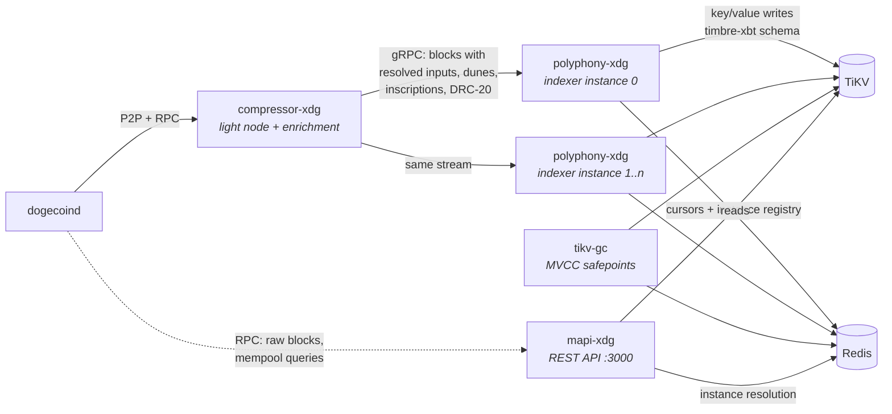

# Maestro Dogecoin Indexer

[](https://github.com/maestro-org/maestro-dogecoin-indexer/actions/workflows/ci.yml)
[](./LICENSE)

**A production-scale, distributed Dogecoin indexing stack** — the system that
powered [Maestro](https://www.gomaestro.org/)'s Dogecoin API platform, now open
source. It indexes the Dogecoin chain — including dunes, inscriptions
("doginals") and DRC-20 — into TiKV, and serves the results as a documented
REST API.

This stack is the Dogecoin sibling of
[maestro-bitcoin-indexer](https://github.com/maestro-org/maestro-bitcoin-indexer):
the same architecture, key schema and operational model, adapted to Dogecoin's
metaprotocols and consensus quirks. The Bitcoin repository's
[design document](https://github.com/maestro-org/maestro-bitcoin-indexer/blob/main/docs/design.md)
is the deep reference for the shared machinery; this README covers the stack
itself and where Dogecoin differs.

## How the pieces make an indexing stack



A stock **Dogecoin Core** node is the source of truth; nothing patches or
extends it (the compose file builds it from the official release binaries,
checksum-verified).

**compressor-xdg** follows the node over P2P and solves the problem that makes
UTXO-chain indexing expensive: a raw block doesn't contain the data an indexer
needs. Inputs are only pointers to outputs of older transactions, and
metaprotocol state (dunes, inscriptions, DRC-20) is a function of all chain
history. Compressor resolves every input, runs the metaprotocol state machines,
and serves *enriched blocks* over gRPC — paged history for backfills and an
apply/undo stream at the tip. The expensive state is computed **once**, so
indexer instances downstream stay cheap enough to create and discard freely —
the property the whole operational model rests on.

**polyphony-xdg** is the indexer. It consumes enriched blocks and folds them
through configurable *reducers* into key/value writes, expressed in a small
action DSL that is merged and batched before committing to TiKV. Each running
polyphony is an *instance* whose identity — `(dataplane_id, instance_id)` —
prefixes every key it writes, so many instances (including duplicates of the
same reducers) index in parallel in one cluster without interfering. After
every commit an instance publishes a cursor entry (height, block hash, TiKV
commit timestamp) to Redis.

**timbre-xbt** is a library, not a service: the byte-level schema of every key
and value in the store. The Dogecoin stack shares the Bitcoin key schema —
polyphony links it to write, mapi links it to read; the two never talk to each
other. Data is the interface.

**mapi-xdg** is the stateless REST API. Per request, it resolves *which
instance's data to read* from the Redis instance registry and decodes timbre
keys and values into responses. A small group of endpoints (raw blocks, node
info, mempool queries) proxy the Dogecoin node's RPC directly — the reducers
behind index-derived equivalents were never part of the Dogecoin deployment.

**tikv-gc** owns TiKV's MVCC garbage-collection safepoint, advancing it only
past timestamps no reader can still need. Without it, TiKV never collects old
versions at all.

**TiKV** stores the indexed data; **Redis** is the coordination plane: cursors,
the instance registry, GC bookkeeping. It holds no indexed data and is
repopulated by running instances if lost.

## Where Dogecoin differs from the Bitcoin stack

- **Dunes, not runes.** Dogecoin's runes-protocol analogue is implemented
  in-tree (`polyphony-xdg/src/dunes`, `compressor-xdg/src/storage/runes/dunes`)
  rather than via the `ordinals` crate, with Dogecoin's activation heights and
  symbol rules. DRC-20 reuses the BRC-20 state machine.
- **No mempool pipeline.** The Bitcoin stack streams enriched mempool
  pseudo-blocks; the Dogecoin deployment never did. Mempool endpoints in the
  API proxy the node's RPC instead.
- **No satoshi-range tracking.** Dogecoin's early block rewards were randomly
  generated, which makes ordinal-style sat numbering ill-defined; range
  tracking is disabled, and the vestigial fee-sweep arithmetic that assumes the
  Bitcoin subsidy schedule is documented in-code as a known limitation.
- **Node RPC in the read path.** `/blocks/*`, `/general/info` and the
  `/rpc/*` groups read from Dogecoin Core directly rather than from TiKV.
- **Reads at the current timestamp.** The cross-reducer snapshot unification
  and time-travel reads of the Bitcoin API are not part of this stack.

## Quickstart (testnet)

Requires Docker. First run syncs Dogecoin testnet from scratch — allow several
hours.

```bash
docker compose up -d --build
```

Watch it come to life:

```bash
# compressor sync progress (node + enrichment)
curl -s localhost:50052/health | jq

# reducers committing to TiKV
docker compose logs -f polyphony-a

# the API (Swagger UI: http://localhost:3000/swagger-ui)
curl -s localhost:3000/healthcheck
```

Once synced, explore:

```bash
# a block (proxied from the node) and an address's UTxOs (from the index)
curl -s "localhost:3000/blocks/latest" | jq
curl -s "localhost:3000/addresses/<addr>/utxos" | jq

# dunes: info, holders, utxos
curl -s "localhost:3000/assets/dunes" | jq
curl -s "localhost:3000/assets/dunes/<dune>/holders" | jq

# inscriptions and DRC-20
curl -s "localhost:3000/assets/inscriptions/<id>/content_body" | jq
curl -s "localhost:3000/assets/drc20" | jq
```

### The showcase: parallel instances and swap-over

Start a **second indexer instance** at any time:

```bash
docker compose --profile multi up -d polyphony-b
```

It backfills the whole chain in parallel — invisible to the API — and the
moment it catches up with the tip it registers itself and the API starts
reading from it. This is how reducer upgrades ship with zero downtime: no
migrations, no locks, no API restarts.

### Mainnet

```bash
docker compose -f docker-compose.yml -f docker-compose.mainnet.yml up -d --build
```

Bring disk and patience: the Dogecoin mainnet chain is ~5.8M blocks (one-minute
blocks), and the compressor rolldb grows past a terabyte with full enrichment
state.

### Playground (developer loop)

Run the Rust services natively — with fast incremental rebuilds — against a
local TiKV from [tiup](https://tiup.io) and a dockerised node/Redis:

```bash
make playground-up    # tiup playground --mode tikv-slim, dogecoind, redis
make playground-run   # cargo-built services, logs in ./tmp/playground
make playground-down
```

## Documentation

- [Bitcoin repository design document](https://github.com/maestro-org/maestro-bitcoin-indexer/blob/main/docs/design.md)
  — the shared architecture in depth (start here)
- [docs/reducers.md](docs/reducers.md) — the Dogecoin reducer catalogue
- [docs/operations.md](docs/operations.md) — scaling from this compose file to
  a production topology
- Per-service READMEs under [services/](services/)

## Security

mapi-xdg has no in-process authentication or rate limiting — put it behind a
gateway before exposing it. The `maestro`/`maestro` node RPC credentials in the
example configs are for local development only.

## Acknowledgements

polyphony-xdg began as a fork of TxPipe's
[Scrolls](https://github.com/txpipe/scrolls) and has since been substantially
rewritten; it is built on the
[gasket](https://github.com/construkts/gasket-rs) pipeline framework.
Metaprotocol handling builds on [ord](https://github.com/ordinals/ord) and the
[ordinals](https://crates.io/crates/ordinals) crate (the dunes implementation
is a Dogecoin adaptation of the runes protocol machinery), Dogecoin block
decoding uses a maintained fork of
[rust-bitcoin](https://github.com/maestro-org/rust-bitcoin), and
compressor-xdg's P2P handshake derives in part from
[metashrew](https://github.com/sandshrewmetaprotocols/metashrew) (see
[NOTICE](NOTICE)).

## License

Apache-2.0. Originally built by the Maestro engineering team. See
[NOTICE](NOTICE) for third-party attributions.
